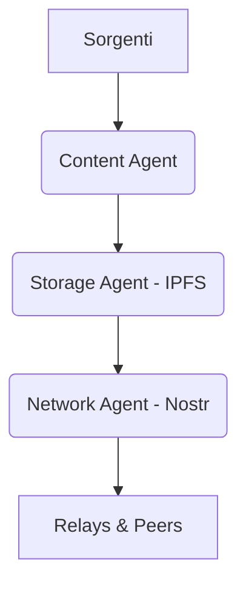

# Podcast Generator

Pipeline automatica che trasforma newsletter in episodi podcast in **italiano**, pronti da ascoltare.

> [!IMPORTANT]
> **PodcastGen 3.0 (Versione in Sviluppo):** Stiamo migrando verso un'architettura **Agent-Centric e Decentralizzata** (Nostr + IPFS). Consulta la [Roadmap Tecnica v3.0](docs/v3-agent-centric-roadmap.md) per i dettagli dell'implementazione P2P.

## Quick Start

```bash
git clone <url> && cd podcast-generator
python3 -m venv .venv && source .venv/bin/activate
pip install -r requirements.txt
playwright install firefox
cp .env.example .env
# modifica .env con la tua GEMINI_API_KEY e la sorgente newsletter

# CLI
python main.py daily

# Web App
uvicorn podcast_generator.web.app:app --reload
```

## Documentazione

| Documento | Contenuto |
|---|---|
| `docs/library.md` | Usare come libreria Python (API completa, configurazione, esempi) |
| `docs/web-app.md` | Usare come web app (auth OAuth, REST API, deploy, IMAP) |
| `ROADMAP.md` | Stato attuale e funzioni future |

## Architettura (Versione 3.0 - Agent-Centric)

In PodcastGen 3.0, il sistema non è più un monolite procedurale ma un'orchestra di **Agenti Specializzati** che comunicano via protocolli P2P:

- **Content Agent:** Gestisce lo scraping e la sintesi AI (LLM + TTS).
- **Storage Agent:** Gestisce l'archiviazione distribuita su **IPFS**.
- **Network Agent:** Gestisce l'identità e la comunicazione tramite **Nostr**.
- **Social Agent:** Gestisce community e interazioni senza server centrali.



## Installazione

### Da sorgente

```bash
python3 -m venv .venv && source .venv/bin/activate
pip install -r requirements.txt
playwright install firefox
cp .env.example .env
```

### Docker

```bash
docker build -t podcast-generator .
docker run -p 8000:8000 \
  -v $(pwd)/.env:/app/.env \
  -v $(pwd)/output:/app/output \
  podcast-generator
```

## Configurazione

### Multi-LLM

| Variabile | Default | Provider |
|---|---|---|
| `LLM_PROVIDER` | `gemini` | `gemini`, `openai`, `anthropic`, `ollama` |
| `GEMINI_API_KEY` | — | Google Gemini |
| `GEMINI_MODEL` | `gemini-2.0-flash` | Google Gemini |
| `OPENAI_API_KEY` | — | OpenAI |
| `OPENAI_MODEL` | `gpt-4o-mini` | OpenAI |
| `ANTHROPIC_API_KEY` | — | Anthropic |
| `ANTHROPIC_MODEL` | `claude-3-5-haiku-latest` | Anthropic |
| `OLLAMA_BASE_URL` | `http://localhost:11434` | Ollama |
| `OLLAMA_MODEL` | `llama3` | Ollama |

### TTS

| Variabile | Default | Provider |
|---|---|---|
| `TTS_PROVIDER` | `edge` | `edge`, `elevenlabs` |
| `TTS_VOICE` | `it-IT-GiuseppeNeural` | Voci Edge-TTS italiane |
| `ELEVENLABS_API_KEY` | — | ElevenLabs |
| `ELEVENLABS_VOICE` | — | ElevenLabs voice ID |

### Newsletter / Scraping

| Variabile | Obbligatoria | Default | Descrizione |
|---|---|---|---|
| `NEWSLETTER_URL` | No* | — | URL principale newsletter |
| `ARCHIVE_URL` | No* | `{NEWSLETTER_URL}/archive` | URL archivio articoli |
| `LANGUAGE` | No | `italiano` | Lingua di traduzione (italiano, inglese, francese, tedesco, spagnolo, portoghese) |
| `LOAD_MORE_SELECTOR` | No | `button:has-text('Load More')...` | Selettore CSS per caricare più articoli |
| `LINK_PATTERN` | No | `/p/` | Pattern regex per link articoli |

\* Almeno uno tra `NEWSLETTER_URL` e `ARCHIVE_URL` deve essere impostato.

### Web App — Autenticazione

Supporta **OAuth** (Google/GitHub) e **password condivisa** come fallback.

| Variabile | Default | Ruolo |
|---|---|---|
| `OAUTH_GOOGLE_CLIENT_ID` | — | Client ID Google OAuth |
| `OAUTH_GOOGLE_CLIENT_SECRET` | — | Client Secret Google OAuth |
| `OAUTH_GITHUB_CLIENT_ID` | — | Client ID GitHub OAuth |
| `OAUTH_GITHUB_CLIENT_SECRET` | — | Client Secret GitHub OAuth |
| `JWT_SECRET` | `change-me` | Chiave HMAC per firma JWT (cambiare in produzione) |
| `WEB_PASSWORD` | — | Password fallback (se nessun OAuth configurato) |
| `API_TOKEN` | — | Token per autenticazione REST API (vuoto = API pubbliche) |
| `WEB_PORT` | `8000` | Porta di ascolto |
| `WEB_HOST` | `0.0.0.0` | Indirizzo di ascolto |

**Flusso autenticazione Web UI:**
1. Se `OAUTH_GOOGLE_CLIENT_ID` o `OAUTH_GITHUB_CLIENT_ID` configurato → pulsanti OAuth nella pagina di login
2. Se solo `WEB_PASSWORD` impostato → form password
3. Se nessuno dei due → accesso libero (modalità sviluppo)
4. L'RSS feed e i download audio sono pubblici (nessuna autenticazione)

**URI di callback da registrare in Google Cloud Console:**
```
http://localhost:8000/auth/callback
```

### IMAP (Email)

| Variabile | Default | Ruolo |
|---|---|---|
| `IMAP_HOST` | — | Server IMAP (es. `imap.gmail.com`) |
| `IMAP_USER` | — | Indirizzo email |
| `IMAP_PASSWORD` | — | App password (Gmail) |
| `IMAP_FOLDER` | `INBOX` | Cartella IMAP o label Gmail |
| `IMAP_MAX_EMAILS` | `100` | Email massime per batch (1-1000) |

## Utilizzo

### CLI

```bash
python main.py daily                               # Episodio giornaliero
python main.py weekly                              # Compilation settimanale
python main.py weekly --days 14                    # Personalizza giorni
python main.py fetch-all                           # Backfill newsletter passate
python main.py fetch-all --limit 10                # Prime 10 nuove
python main.py status                              # Stato tracker
python main.py v3-generate                         # V3 PoC: Decentralized Flow
```

### Python Library

```python
import asyncio
from podcast_generator import PodcastGenerator, Settings

# Multi-LLM: cambia solo la variabile d'ambiente
cfg = Settings(llm_provider="openai", openai_api_key="sk-...")

gen = PodcastGenerator(cfg)

# Episodio giornaliero
episode = await gen.fetch_and_build_latest()

# Da URL specifici
articles = await gen.fetch_articles("https://newsletter.example.com")
episode = await gen.build_from_urls([articles[0].href])

print(f"Audio: {episode.audio_path}, Durata: {episode.duration_minutes} min")
```

### REST API

```bash
curl -X POST http://localhost:8000/api/v1/generate \
  -H "Authorization: Bearer $API_TOKEN" \
  -H "Content-Type: application/json" \
  -d '{"urls": ["https://newsletter.example.com/p/article"]}'

# Risposta: {"job_id": "...", "status": "processing", "status_url": "..."}

curl http://localhost:8000/api/v1/status/{job_id} \
  -H "Authorization: Bearer $API_TOKEN"
```

Documentazione interattiva: http://localhost:8000/docs

### Web UI

```bash
uvicorn podcast_generator.web.app:app --reload
```

Apri http://localhost:8000.

**Sorgenti supportate:**
- **Web** — incolla URL newsletter (Beehiiv, Substack, etc.)
- **RSS** — feed RSS automatizzato
- **Email** — configura IMAP via Impostazioni

Seleziona articoli, clicca **Genera Podcast**, attendi (polling HTMX), scarica l'MP3.

## Struttura del progetto

```
├── podcast_generator/          # Libreria Python
│   ├── agents/                 # Agenti v3.0 (Content, Network, Storage, Social)
│   ├── config.py               # Pydantic Settings V2 (multi-LLM, OAuth)
│   ├── models.py               # Pydantic models
│   ├── exceptions.py           # Errori custom
│   ├── fetcher.py              # Playwright scraping
│   ├── translator.py           # Multi-LLM (Gemini, OpenAI, Anthropic, Ollama)
│   ├── tts.py                  # Edge-TTS / ElevenLabs
│   ├── audio.py                # pydub utilities
│   ├── tracker.py              # JSON deduplicazione
│   ├── builder.py              # PodcastGenerator (API pubblica)
│   ├── pipeline.py             # Rich CLI wrapper
│   └── web/
│       ├── app.py              # FastAPI (Web UI + REST API + OAuth)
│       ├── auth.py             # OAuth (Google/GitHub) + JWT + Bearer token
│       ├── db.py               # sqlite3 (episodi + utenti)
│       └── templates/          # Jinja2 + HTMX + Tailwind
├── main.py                     # CLI entrypoint (Typer)
├── Dockerfile                  # Deploy containerizzato
├── pyproject.toml              # Metadati pacchetto
├── requirements.txt            # Dipendenze
├── .env.example                # Template configurazione
├── tests/
│   ├── test_core.py
│   └── test_web.py
└── docs/
    ├── library.md              # Documentazione libreria
    └── web-app.md              # Documentazione web app
```

## Automazione (cron)

```cron
# Ogni lunedì alle 8:00
0 8 * * 1 cd /home/utente/podcast-generator && .venv/bin/python3 main.py weekly >> cron.log 2>&1
```

## Stack

| Componente | Tecnologia | Costo |
|---|---|---|
| Scraping | Playwright (Firefox) | Gratuito |
| LLM | Gemini / OpenAI / Anthropic / Ollama | Gratuito (Gemini free tier) |
| TTS | Edge-TTS (Microsoft) | Gratuito |
| Audio | pydub + FFmpeg | Gratuito |
| CLI | Typer + Rich | Gratuito |
| Web | FastAPI + HTMX + Tailwind | Gratuito |
