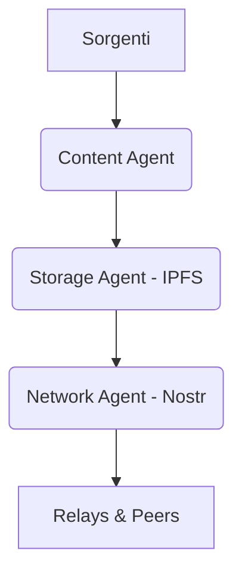

# Podcast Generator

> **Nota:** Questo progetto è ora parte dell'ecosistema [AgentMesh](../../README.md) come applicazione di riferimento per l'architettura decentralizzata.

Pipeline automatica che trasforma newsletter in episodi podcast in **italiano**, pronti da ascoltare.

## Quick Start

```bash
uv sync
playwright install firefox
cp .env.example .env
# modifica .env con la tua GEMINI_API_KEY e la sorgente newsletter

# CLI
python main.py daily

# Web App
uvicorn podcast_generator.web.app:app --reload
```

## Architettura v3.0 (AgentMesh)

PodcastGen utilizza gli agenti di AgentMesh per gestire il flusso di lavoro:

- **Content Agent:** Gestisce lo scraping e la sintesi AI.
- **Storage Agent:** Gestisce l'archiviazione distribuita su **IPFS**.
- **Network Agent:** Gestisce l'identità e la comunicazione tramite **Nostr**.



## Documentazione

- [Guida all'uso della Web App](../../docs/web-app.md)
- [Uso come Libreria Python](../../docs/library.md)
- [Roadmap AgentMesh](../../docs/ROADMAP.md)
