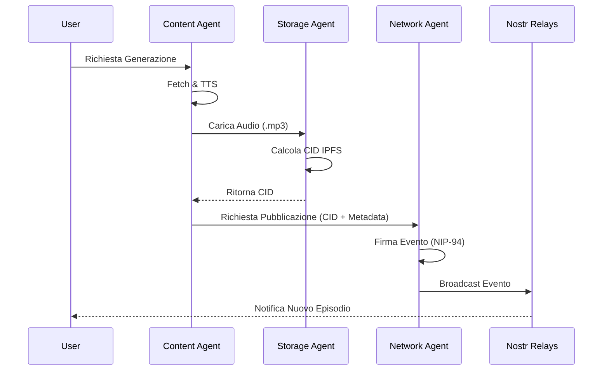

# Analisi Tecnica e Roadmap PodcastGen 3.0

## 1. Analisi dello Stato Attuale
PodcastGen v2.x è un sistema monolitico e procedurale. Sebbene funzionale per l'uso singolo, presenta limitazioni in termini di:
- **Resilienza:** Dipendenza da un server centrale (se implementato in cloud).
- **Costi:** L'hosting di file audio è costoso.
- **Interattività:** La community è isolata in database locali.

## 2. Architettura Proposta (Agent-Centric)
La versione 3.0 introduce un paradigma **Multi-Agente Disaccoppiato** che comunica via protocolli P2P.

### Gli Agenti Specializzati
1.  **Content Agent:** Eredita la logica di `builder.py`. Si occupa di scraping, traduzione (LLM) e sintesi vocale (TTS).
2.  **Storage Agent:** Gestisce l'integrità e la disponibilità dei dati tramite **IPFS**. Sostituisce il filesystem locale/S3 con un sistema a indirizzamento per contenuto (CID).
3.  **Network Agent:** Gestisce l'identità sovrana tramite chiavi pubbliche/private **Nostr**. Pubblica eventi standardizzati per annunciare nuovi episodi.
4.  **Social Agent:** Monitora i relay Nostr per gestire commenti, reaction e feed condivisi senza database centrali.

## 3. Specifiche Tecniche del Protocollo P2P

### Flusso di Pubblicazione (Sequence Diagram)

### Protocolli e NIP Adoptati
*   **Identità:** NIP-01 (Basic protocol flow) e NIP-19 (Bech32-encoded keys/events).
*   **Metadata File:** **NIP-94 (File Metadata)**. Questo permette ai client Nostr di riconoscere l'evento come un file multimediale scaricabile, con tag per:
    *   `url`: Link IPFS/Gateway.
    *   `x`: Hash del file (SHA-256).
    *   `m`: MIME type (`audio/mpeg`).
    *   `alt`: Descrizione testuale per accessibilità.
*   **Discovery:** NIP-02 (Contact List) per seguire altri creatori di podcast.

## 4. Roadmap di Sviluppo

### Fase 1: Fondamenta (Completata)
- [x] Definizione `BaseAgent`.
- [x] Implementazione `NetworkAgent` (Nostr integration).
- [x] Implementazione `StorageAgent` (IPFS abstraction).
- [x] Implementazione `ContentAgent` (Wrapper logica v2).
- [x] Proof of Concept CLI (`v3-generate`).

### Fase 2: Integrazione IPFS Reale
- [ ] Integrazione con client IPFS locale o servizio di pinning (es. Pinata).
- [ ] Gestione cache LRU per i CID scaricati.

### Fase 3: Protocollo Nostr Avanzato
- [ ] Implementazione NIP-94 (File Metadata) per una migliore compatibilità con i client social.
- [ ] Sistema di gestione chiavi (import/export seed phrase).

### Fase 4: Web UI Decentralizzata
- [ ] Refactoring della Web App per interrogare i relay Nostr invece del database SQLite locale.
- [ ] Player audio che recupera i file direttamente dai gateway IPFS.
